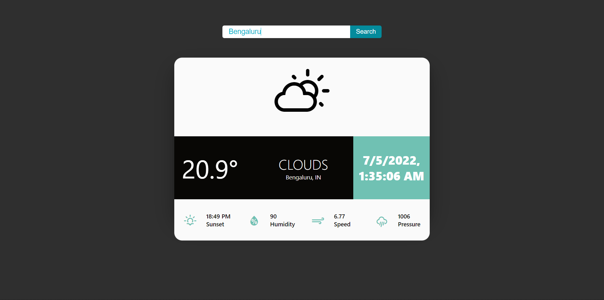

# weather-app
It's a weather web app made using reactjs and open weather map API ⛅.

### Check it out [here]!
 

 [here]:<https://asishraju.me/Weather-App/>

## Overview 👀

- A simple weather app that uses Open weather map api to grab weather data of a city
- Minimalist design
- Frontend made with React-js and material-ui
- Stores location data on local storage for faster fetching of data

## WIP 🛠
- Use of Geo-Location browser api
- Mobile APP

## How To Contribute🤝 
- Yes,it is open source you can clone and change code to your need.
- Most of the code is self explanatory, anyhow
- for any clarification on code or want to contribute contact 
- [Gmail] / [Instagram] / [LinkedIn]

[Gmail]: <mailto:coolshagun.sangwan15@gmail.com>
[LinkedIn]: <https://www.linkedin.com/in/sagun-sangwan-9662401b2/>
[Instagram]: <https://www.instagram.com/_sangwan_shagun/>
